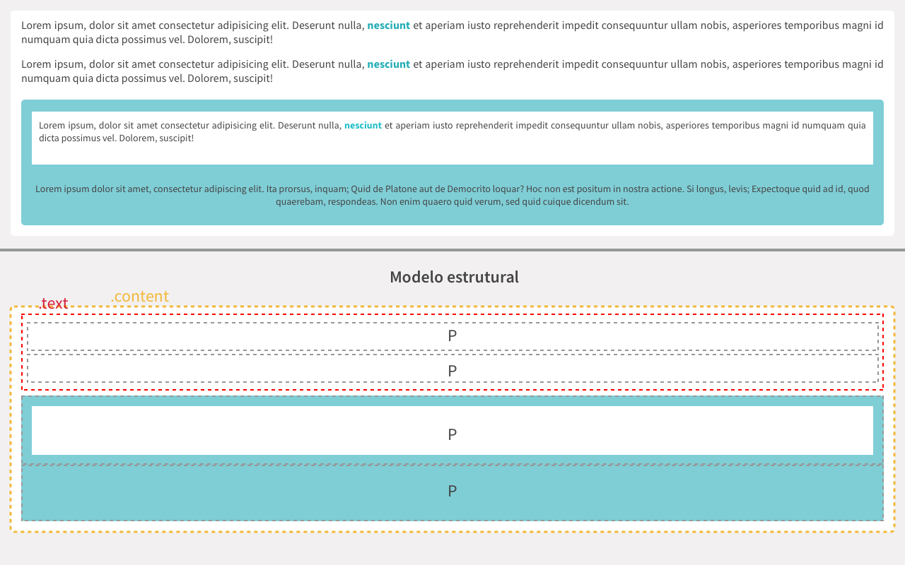

> Antes de começar, lembre-se: **Não faça commit na branch master**

# Desafio CSS
Este conteúdo tem por objetivo auxiliar no aprendizado de CSS e SASS aplicando suas regras em projeto simulado. Serão vários desafios com temáticas específicas, focando em pequenos assuntos para melhor o aprendizado.
Vamos treinar um pouco as técnicas do CSS, focando em uma abordagem dividida em três passos:

* Um protótipo será apresentado
* O HTML estará escrito e não deve ser alterado
* O CSS estará vazio, e ele deve ser escrito para fazer o HTML se comportar corretamente

# Como enviar seu resultado?
* Clone este repositório
* Crie uma branch com seu nome, todo em minusculo: `git checkout -b nome-sobrenome`
* Após finalizado, basta realizar o commit e o push.
* Me envie uma mensagem avisando do seu commit para que eu possa validar seu resultado.

# Desafio 01
Neste desafio, vamos utilizar os sinais do CSS: **>** e **+**

## Sinal >
O sinal de > representa um filho direto do elemento anterior.

```css
.classe-pai > .classe-filho-direto
```

Assim, podemos usar para representar uma alteração que só deve afetar um filho direto da classe:

```html
<div class="classe-pai">
  <p>Teste de filho direto</p>
  
  <div class="classe-interna">
    <p>Teste de filho indireto</p>
  </div>
</div>
```

```css
.classe-pai p {  
  color: blue;
}
```
O CSS acima fará com que todos os `<p>` fiquem na cor azul por estar aplicando para todos os filhos de `.classe-pai`.

```css
.classe-pai > p {  
  color: red;
}
```

Já este css, aplicará o tom de vermelho apenas para o `<p>` que está dentro da `.classe-pai` e, não está dentro de outra classe. Assim, o `<p>` que está dentro de `.classe-interna` não receberá a cor vermelha.

## Sinal +
Seleciona o elemento imediatamente após a classe anterior.
```css
.classe + .classe2
```

Assim, podemos usar para representar uma alteração feita no elemento direto da classe:

```html
<div class="content">
  <h1>Texto comum</h1>
  <p>Texto vermelho</p>
  <p>Texto comum</p>
</div>
```

```css
h1 + p {
  color: red;
}
```

O trecho acima aplica a cor vermelha apenas no `<p>` com o *Texto vermelho*.

Isso ocorre por que o sinal de + está logo após o `<h1>`.

Assim, o segundo `<p>` por estar depois de outro elemento, não recebe a cor.

# Hora do desafio
Agora, vamos aplicar este conhecimento em alguns HTMLs.

## Protótipo


## HTML
```html
<!DOCTYPE html>
<html lang="pt-br">
<head>
  <meta charset="UTF-8">
  <meta name="viewport" content="width=device-width, initial-scale=1.0">
  <meta http-equiv="X-UA-Compatible" content="ie=edge">
  <title>Desafio 1</title>
  <link rel="stylesheet" href="style.css">
</head>
<body>
  <div class="content">
    <div class="text">
      <p>Lorem ipsum, dolor sit amet consectetur adipisicing elit. Deserunt nulla, <strong>nesciunt</strong> et aperiam iusto reprehenderit impedit consequuntur ullam nobis, asperiores temporibus magni id numquam quia dicta possimus vel. Dolorem, suscipit!</p>
      <p>Lorem ipsum, dolor sit amet consectetur adipisicing elit. Deserunt nulla, <strong>nesciunt</strong> et aperiam iusto reprehenderit impedit consequuntur ullam nobis, asperiores temporibus magni id numquam quia dicta possimus vel. Dolorem, suscipit!</p>
    </div>
    <p>Lorem ipsum, dolor sit amet consectetur adipisicing elit. Deserunt nulla, <strong>nesciunt</strong> et aperiam iusto reprehenderit impedit consequuntur ullam nobis, asperiores temporibus magni id numquam quia dicta possimus vel. Dolorem, suscipit!</p>
    <p>Lorem ipsum, dolor sit amet consectetur adipisicing elit.</p>
  </div>
</body>
</html>
```

## Resolução
Utilize os recursos aprendidos aqui para fazer o layout exatamente como proposto.

No diretório `src` você encontrará o arquivo `index.html` e `style.css`.

O arquivo `index.html` não deve ser alterado, tudo o que está lá deve ser mantido exatamente como está.

O arquivo `style.css` é onde a mágica deve ocorrer.

Não se preocupe com **Sass** ou processadores assim, não faremos uso por enquanto.
